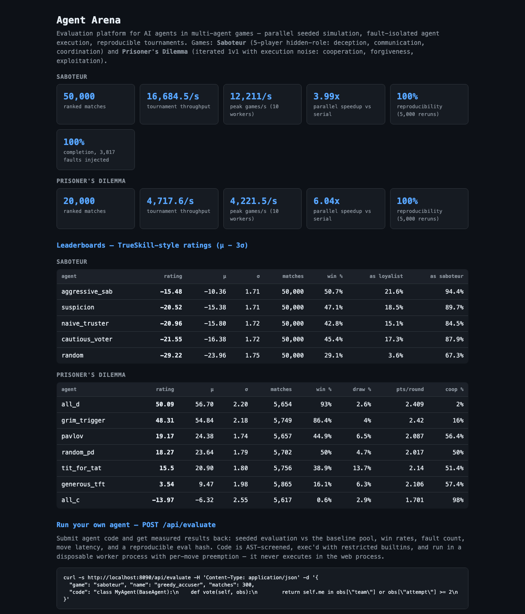

# Agent Arena

Evaluation platform for AI agents in multi-agent games — parallel
seeded simulation, fault-isolated agent execution, reproducible
tournaments, automated result collection, a live leaderboard, and a
public evaluation API for submitted agents.

**Live demo:** https://agent-arena-r172.onrender.com — leaderboards,
match replays, and the `POST /api/evaluate` submission endpoint. (Free
tier: the first request after idle takes ~50 s to wake the instance.)



*The web UI: measured platform stats and per-game leaderboards. Run it
with `uv run uvicorn arena.web.app:app --port 8090` — no accounts, no
cloud.*

Two games ship, behind one pluggable `GameDef` registry
([arena/games.py](arena/games.py) — adding a game is one entry):

**Saboteur** (Resistance-style hidden-role): 5 players, 2 secret
saboteurs who know each other. Rounds of team proposal → structured
discussion (accuse/vouch messages) → majority vote → secret mission
cards; any sabotage card fails the round; first side to 3 round wins.
Exercises **planning**, **strategic reasoning**, **communication**,
**deception**, and **coordination**.

**Prisoner's Dilemma** (iterated 1v1): a seeded-random 100–200 rounds
(hidden from agents, so end-game defection can't be timed) with 2%
seeded execution noise — intended actions occasionally flip, and both
players observe realized actions, which is what makes forgiveness
strategies matter. Payoffs 3/3, 1/1, 5/0. Exercises **cooperation**,
**retaliation**, **forgiveness**, and **exploitation**.

## Measured results (M-series MacBook, 10 cores, Python 3.12)

| Metric | Saboteur | Prisoner's Dilemma | How measured |
|---|---|---|---|
| Peak throughput | **12,211 games/s** (3,058 serial) | **4,222 games/s** (698 serial) | `arena.cli bench`, 10,000 matches, 10 worker processes |
| Parallel speedup | **3.99×** | **6.04×** | same benchmark (10-core M-series; efficiency cores and thermal state make speedups vary ±20% run to run) |
| Reproducibility | **100.00%** (5,000/5,000) | **100.00%** (5,000/5,000) | `arena.cli verify` — every match replayed under different parallelism yields a byte-identical SHA-256 transcript hash |
| Ranked tournament | **50,000 matches in 3.0 s** | **20,000 matches in 4.2 s** | `arena.cli tournament`, full result collection to SQLite + ratings |
| Fault isolation | **100% completion**, 3,817 faults contained in 1,000 matches | (shared sandbox) | `arena.cli faults` — matches seeded with agents that crash and infinite-loop on every turn |

PD matches are ~3× more agent calls than Saboteur (2 players × up to
200 rounds), hence the lower games/s at similar moves/s. The exact
JSON for every number above is committed under [results/](results/).
The committed results DB keeps ratings, stats, and the 400 sampled
replay transcripts (summary rows for all 70,000 matches are pruned for
size); tournaments are seeded, so `arena.cli tournament` regenerates
the full database bit-for-bit.

## Mechanisms

- **Determinism**: a match is a pure function of `(game, lineup,
  seed)`. One master seed generates the whole tournament schedule;
  role assignment, round counts, noise, and every agent's private RNG
  stream derive from the match seed. Transcripts are canonical-JSON
  SHA-256 hashed, so any result is independently re-verifiable. The
  tournament runner exploits this: it collects statistics from a
  transcript-free pass, then *replays* a sample of matches for the
  match viewer and asserts the hashes match.
- **Sandboxing** ([arena/runner/sandbox.py](arena/runner/sandbox.py)):
  every agent call runs under a 100 ms **CPU-time** preemption timer
  (ITIMER_VIRTUAL — even `while True:` is interrupted, and because the
  budget is CPU time rather than wall clock, fault verdicts don't
  depend on machine load), exceptions are contained, and actions are
  validated by the referee. Violations substitute a deterministic
  fallback action, are recorded as faults in the transcript, and three
  faults downgrade the seat for the rest of the match. Agents receive
  immutable views of game state, so they can't corrupt the referee's
  transcript. Matches run in worker OS processes, and the evaluation
  API gives each submission its own disposable process with a
  wall-clock kill — untrusted code never touches the web process.
- **Parallel orchestration**
  ([arena/runner/orchestrator.py](arena/runner/orchestrator.py)):
  matches fan out over a `ProcessPoolExecutor` with chunked
  scheduling; results stream back for collection.
- **Ratings** ([arena/ratings.py](arena/ratings.py)): each game maps a
  finished match to openskill Plackett-Luce teams — Saboteur as
  loyalists-vs-saboteurs 3v2, PD as 1v1 with draws as ties. Seeded
  schedules balance seats and roles, so ratings converge to
  role-balanced skill estimates; the leaderboard shows the
  conservative μ − 3σ plus per-game extras (per-role win rates;
  points/round and cooperation rate).

## Submitting an agent via the API

`POST /api/evaluate` runs your agent against the chosen game's
baseline pool and returns measured results — no local setup needed:

```bash
curl -s https://<host>/api/evaluate -H 'Content-Type: application/json' -d '{
  "game": "dilemma", "name": "tit_for_two_tats", "matches": 300,
  "code": "class MyAgent(PDAgent):\n    def play(self, obs):\n        h = obs[\"history_opp\"]\n        return len(h) < 2 or h[-1] or h[-2]"
}'
# -> {"win_pct": 7.7, "draw_pct": 7.0, "pts_per_round": 2.168, "coop_pct": 65.7,
#     "faults": 0, "avg_move_ms": 0.001, "eval_hash": "113b9a92...", ...}
```

Evaluations are deterministic — an identical request (`code`, `name`,
`matches`, `seed`, `game`) returns the same `eval_hash` on any machine
(verified: local and the deployed container produce byte-identical
hashes). The agent name is part of the recorded transcript, so
renaming an agent changes its hash. Evaluated agents appear on the
live submissions leaderboard (`GET /api/submissions`). Submitted code is defended in
depth: AST screening rejects imports outside a small stdlib allowlist
(math, random, itertools, collections, statistics, functools, heapq,
bisect), dunder access, and dangerous builtins
(`exec`/`open`/`getattr`/...); execution uses restricted builtins; and
everything runs in a disposable worker process with per-move CPU-time
preemption and a 60-second wall-clock kill from the parent — submitted
code never executes in the web process. (A production deployment would
add container/microVM isolation per submission.) Set the
`ARENA_API_KEY` env var to require an `X-API-Key` header; evaluation
concurrency is capped and `matches` is limited to 1,000 per request.

### Agent interfaces

Saboteur — subclass `BaseAgent`
([arena/agents/baselines.py](arena/agents/baselines.py)); the
observation is a plain dict including the full public event log;
saboteurs additionally see their partner:

```python
class MyAgent(BaseAgent):
    def propose(self, obs) -> list[int]   # pick a team of obs["team_size"]
    def discuss(self, obs) -> dict        # {"accuse": pid|None, "vouch": pid|None}
    def vote(self, obs) -> bool           # approve the proposed obs["team"]?
    def mission(self, obs) -> bool        # True = success, False = sabotage
```

Prisoner's Dilemma — subclass `PDAgent`
([arena/game/dilemma.py](arena/game/dilemma.py)):

```python
class MyAgent(PDAgent):
    def play(self, obs) -> bool
    # obs: round, history_self, history_opp (realized, post-noise),
    #      score_self, score_opp
```

Rules for both: use only `self.rng` for randomness (determinism), stay
under 100 ms of CPU time per move. Saboteur agents play both roles. For a
permanent (non-ephemeral) entry, register the class in the game's
registry and rerun the tournament.

### Reading the baseline leaderboards

Two honest quirks, both deliberate talking points:

- *Saboteur*: `aggressive_sab` (always sabotage) tops the pool because
  baseline loyalists under-punish exposed sabotage — deception only
  pays against opponents smart enough to punish honesty.
- *Dilemma*: `all_d` tops the win-rate rating because ratings measure
  head-to-head dominance, while `grim_trigger` earns the most
  points/round — the classic Axelrod gap between winning matches and
  maximizing welfare. Tit-for-tat almost never *beats* anyone (it can
  only draw or narrowly lose), yet scores well on points.

Both gaps are exactly what submitted agents are meant to attack.

## LLM agents & natural-language deception (`dilemma_comms`)

A research variant adds a **free-text "cheap talk" channel** to iterated
Prisoner's Dilemma: before each round's move, both players exchange one
natural-language message the other reads before deciding. This is where
**deception** becomes observable — an agent can *say* "let's cooperate"
and then defect — so the platform measures it: `promise_breaks`
([arena/game/dilemma.py](arena/game/dilemma.py)) flags rounds where an
agent's message promised cooperation but it then intended to defect
(noise is undone so a promise kept-but-noise-flipped isn't counted as a
lie), and the leaderboard reports a per-agent **`betrayal_pct`**. Two
deterministic mock agents (`honest_coop`, `deceiver`) anchor the metric
(0% and 100%).

LLM agents plug into the existing `observation → action` interface via
an adapter that serializes the game state into a prompt, calls the
model, and parses the reply
([arena/agents/llm_pd.py](arena/agents/llm_pd.py), OpenAI). Three
things differ from scripted agents, by design:

- **LLM agents are trusted, run from the CLI/registry — never through
  `/api/evaluate`.** That submission path's AST sandbox blocks imports
  and network on purpose, so an LLM agent can't run there and no public
  endpoint ever makes billed API calls. You supply the key via env.
- **Timing switches to wall-clock.** The per-move limit is CPU-time for
  scripted agents (deterministic) but wall-clock (30 s default) for
  I/O-bound LLM moves; a hung/slow/failed call is contained as a fault
  and replaced by a fallback action, so one flaky API call never
  crashes a match.
- **Reproducibility becomes statistical.** LLM sampling isn't
  byte-reproducible (even at temperature 0), so exact transcript hashes
  no longer hold; the *environment* (round count, 2% noise, ordering)
  stays seeded, and you run N matches and report distributions.

```bash
uv sync --extra llm      # installs the openai SDK (optional; core stays slim)

# deterministic sanity check — no key, no cost:
uv run python -m arena.research series --a deceiver --b honest_coop --matches 20
#   deceiver    avg_score=43.0 coop=1.9% betrayal=100.0% ...
#   honest_coop avg_score= 0.5 coop=100.0% betrayal=0.0% ...

# LLM vs baseline (needs OPENAI_API_KEY):
OPENAI_API_KEY=sk-... OPENAI_MODEL=gpt-4o-mini \
  uv run python -m arena.research series --a llm_openai --b tit_for_tat --matches 10

# LLM vs LLM, different models head-to-head:
OPENAI_API_KEY=sk-... uv run python -m arena.research series \
  --a llm_openai --a-model gpt-4o --b llm_openai --b-model gpt-4o-mini --matches 10
```

The `--out <file>` flag saves full transcripts (messages + moves) to
`results/` for analysis. The keyword-based promise detector is a
first-pass signal, documented as such — swap in a stronger classifier
for publication-grade deception measurement.

### Load-testing the LLM path without a key or token cost

LLM matches are I/O-bound: nearly all wall-clock time is spent *waiting*
on API calls, so the scaling question isn't games/second on the CPU —
it's how many games you can keep in flight while they wait. The
platform answers it with a thread-based runner
([`run_threaded`](arena/runner/orchestrator.py)); a blocking call
releases the GIL, so dozens of games overlap their waits on a few cores.

To measure and tune this for free, a **simulated-API agent**
([arena/agents/sim_llm.py](arena/agents/sim_llm.py)) stands in for a
real model: each move sleeps a sampled latency (mimicking network +
generation time) and fails with a configurable probability (mimicking
API 500s / rate limits), while its game decisions stay seeded. The
`stress` command drives it through the concurrent runner and reports the
concurrency win and fault containment:

```bash
# 60 matches, 32 concurrent, ~0.2s simulated latency, 0% errors:
uv run python -m arena.cli stress --matches 60 --concurrency 32 --latency 0.2

# mimic a real ~1.5s model with a 10% error rate:
uv run python -m arena.cli stress --matches 60 --concurrency 32 \
  --latency 1.5 --error-rate 0.1
```

Measured (60 matches, 30 concurrent, 0.15 s latency, 10% injected
errors): **22.5× concurrency speedup** over serial (13→289 matches/min)
with **180 simulated API errors all contained** as faults — the runner
overlaps the waiting games and no failed call crashes a match. (The
serial baseline runs a prefix of the same seeded specs, so the ratio is
apples-to-apples rather than an inflated headline.) Point it at a real
key by running the same load through `arena.research` instead; the
simulator lets you size concurrency and validate fault handling before
spending a cent.

## Running

```bash
uv sync
uv run pytest                                            # 34 tests: engines, isolation, API, comms
uv run python -m arena.cli [--game dilemma] bench       --matches 10000
uv run python -m arena.cli [--game dilemma] verify      --matches 5000
uv run python -m arena.cli [--game dilemma] tournament  --matches 50000
uv run python -m arena.cli faults --matches 1000         # saboteur pool
uv run uvicorn arena.web.app:app --port 8090             # leaderboard UI + API
```

Deployed on Render's free tier (Docker; the image bundles the code and
the results DB; ranked leaderboards are read-only, the evaluation API
is live). `render.yaml` + `Dockerfile` are the blueprint; `fly.toml` is
kept for a Fly alternative.
